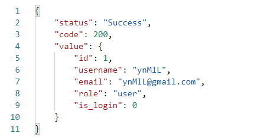
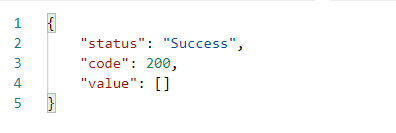

# Lumen PHP Framework

[](https://travis-ci.org/laravel/lumen-framework)
[](https://packagist.org/packages/laravel/lumen-framework)
[](https://packagist.org/packages/laravel/lumen-framework)
[](https://packagist.org/packages/laravel/lumen-framework)

Laravel Lumen is a stunningly fast PHP micro-framework for building web applications with expressive, elegant syntax. We believe development must be an enjoyable, creative experience to be truly fulfilling. Lumen attempts to take the pain out of development by easing common tasks used in the majority of web projects, such as routing, database abstraction, queueing, and caching.

## Official Documentation

Documentation for the framework can be found on the [Lumen website](https://lumen.laravel.com/docs).

## Contributing

Thank you for considering contributing to Lumen! The contribution guide can be found in the [Laravel documentation](https://laravel.com/docs/contributions).

## Security Vulnerabilities

If you discover a security vulnerability within Lumen, please send an e-mail to Taylor Otwell at taylor@laravel.com. All security vulnerabilities will be promptly addressed.

## License

The Lumen framework is open-sourced software licensed under the [MIT license](https://opensource.org/licenses/MIT).

## Mini E-Wallet Documentation

> Pemasangan

1. Install Composer terlebih dahulu disini https://getcomposer.org/download/
2. Download file yang ada di repositori saya dengan cara `git clone https://github.com/Hendrawanss/Mini-e-wallet.git`.
3. Buka Terminal dan install dependensi composer dengan
    ```
    composer install
    ```
4. Ubah file `.env.example` menjadi `.env`.
5. Buat database dengan nama kesukaan anda. 
6. Ubah configurasi yang ada di `.env` 
    ```
    - DB_DATABASE = <nama database anda>
    - DB_USERNAME = <username database anda>
    - DB_PASSWORD = <password database anda>
    ```
7. 
8. lakukan migrasi table dengan command
    ```
    php artisan migrate
    ```
9. Lakukan Seeding dengan command
    ```
    php artisan db:seed
    ```
10. Jalankan aplikasi menggunakan command
    ```
    php -S localhost:8000 -t public
    ```

## API Documentation

> Role
Memiliki 2 Role, yaitu: 

###### Admin

Bisa melakukan beberapa aktivitas seperti:
1. Login
2. Logout
3. Topup balance dari bank
4. Transfer balance ke sesama user
5. Management Table User
    - Create data
    - Read data
    - Update data (di dev lagi) yang boleh diupdate
    - Delete data (di dev lagi) tambah pengecekan history dulu

6.  Table History Balance User
    - Read data

7. Management Table Bank Balance
    - Create data
    - Read data
    - Update data (di dev lagi)
    - Delete data

8. Management Table History Balance Bank
    - Read data

###### User

Bisa melakukan beberapa aktivitas seperti:
1. Login
2. Logout
3. Topup balance dari bank
4. Transfer balance ke sesama user
5. Read User By Id
6. Update Data User

> Route

1. Login

    Menggunakan methode `POST` dengan endpoint `/login`.
    Parameter yang perlu dikirim yaitu `username` dan `password` 

    Contoh:

    `Request`

    

    `Response`

    

2. Logout 

    Menggunakan methode `POST` dengan endpoint `/logout`.
    Parameter yang perlu dikirim yaitu berupa header `Authorization` dengan isian `key user`.

    Contoh:

    `Request`

    

    `Response`

    

3. CRUD Users Table
    - Create data 
    
    Menggunakan methode `POST` dengan endpoint `/user`.
    Parameter yang perlu dikirim yaitu berupa header `Authorization` dengan isian `key user`.

    Contoh:

    `Request`

    

    `Response`
    
    

    - Read All User

    Menggunakan methode `GET` dengan endpoint `/user`.
    Parameter yang perlu dikirim yaitu berupa header `Authorization` dengan isian `key user`.

     Contoh:
    
    `Request`

    

    `Response`

    

    - Read User By Id

    Menggunakan methode `POST` dengan endpoint `/user/id`.
    Parameter yang perlu dikirim yaitu data dengan `key: id`(id user) dan berupa header `Authorization` dengan isian `key user`.

    Contoh:

    `Request`

    

    `Response`

    

    - Update Data User

    Menggunakan methode `PUT` dengan endpoint `/user/{id}`.
    Parameter yang perlu dikirim yaitu data bisa berupa `username`, `email`, `role`, `password`, `status login`, `{id}`(id User) dan header `Authorization` dengan isian `key user`.

    Contoh:

    `Request`

    

    `Response`

    

    - Delete Data User 

    Menggunakan methode `DELETE` dengan endpoint `/user`.
    Parameter yang perlu dikirim yaitu data berupa `{id}`(id user) dan header `Authorization` dengan isian `key user`.

    Contoh:

    `Request`

    

    `Response`

    

4. Read Table User Balance History

    - Read All Data History

    Menggunakan methode `GET` dengan endpoint `/user/history`.
    Parameter yang perlu dikirim yaitu data berupa header `Authorization` dengan isian `key user`.

    Contoh:

    `Request`

    

    `Response`

    

    - Read Data History By User Id

    Menggunakan methode `GET` dengan endpoint `/user/history/{user_id}`.
    Parameter yang perlu dikirim yaitu data berupa `{user_id}` pada bagian endpoint dan header `Authorization` dengan isian `key user`.

    Contoh:

    `Request`

    

    `Response`

    

5. CRUD Balance Bank Table
    - Create data 
    
    Menggunakan methode `POST` dengan endpoint `/bank`.
    Parameter yang perlu dikirim yaitu berupa data `name`, `balance`, `code`, dan header `Authorization` dengan isian `key user`.

    Contoh:

    `Request`

    

    `Response`
    
    

    - Read All Bank

    Menggunakan methode `GET` dengan endpoint `/bank`.
    Parameter yang perlu dikirim yaitu berupa header `Authorization` dengan isian `key user`.

     Contoh:
    
    `Request`

    

    `Response`

    

    - Read Bank By Id

    Menggunakan methode `POST` dengan endpoint `/bank/id`.
    Parameter yang perlu dikirim yaitu data dengan `key: id`(id bank) dan berupa header `Authorization` dengan isian `key user`.

    Contoh:

    `Request`

    

    `Response`

    

    - Update Data Bank

    Menggunakan methode `PUT` dengan endpoint `/bank/{id}`.
    Parameter yang perlu dikirim yaitu data bisa berupa `name`, `balance`, `balance_achieve`, `code`, `enable`, `{id}`(id bank) dan header `Authorization` dengan isian `key user`.

    Contoh:

    `Request`

    

    `Response`

    

    - Delete Data Bank 

    Menggunakan methode `DELETE` dengan endpoint `/bank/{id}`.
    Parameter yang perlu dikirim yaitu data berupa `{id}`(id bank) dan header `Authorization` dengan isian `key user`.

    Contoh:

    `Request`

    

    `Response`

    

6. Read Balance Bank History
    
    - Read All Data History

    Menggunakan methode `GET` dengan endpoint `/bank/history`.
    Parameter yang perlu dikirim yaitu data berupa header `Authorization` dengan isian `key user`.

    Contoh:

    `Request`

    

    `Response`

    

    - Read Data History By Bank Id

    Menggunakan methode `GET` dengan endpoint `/bank/history/{bank_id}`.
    Parameter yang perlu dikirim yaitu data berupa `{bank_id}` pada bagian endpoint dan header `Authorization` dengan isian `key user`.

    Contoh:

    `Request`

    

    `Response`

    

7. User Topup

    Menggunakan methode `POST` dengan endpoint `/user/topup`.
    Parameter yang perlu dikirim yaitu data dengan `bank`(code bank), `nominal`, `type`, `location` dan berupa header `Authorization` dengan isian `key user`.

    Contoh:

    `Request`

    

    `Response`

    

8. User Transfer

    Menggunakan methode `POST` dengan endpoint `/user/tf`.
    Parameter yang perlu dikirim yaitu data dengan `id`(id user tujuan), `nominal`, `type`, `location` dan berupa header `Authorization` dengan isian `key user`.

    Contoh:

    `Request`

    

    `Response`

    